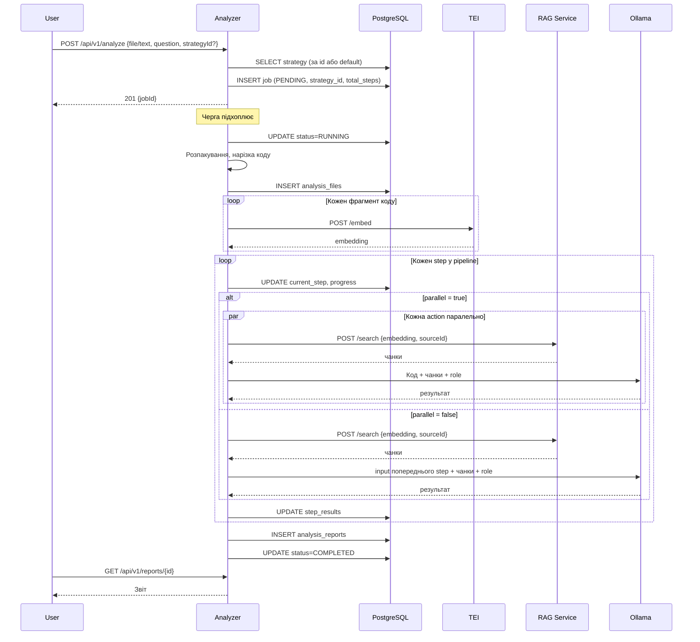
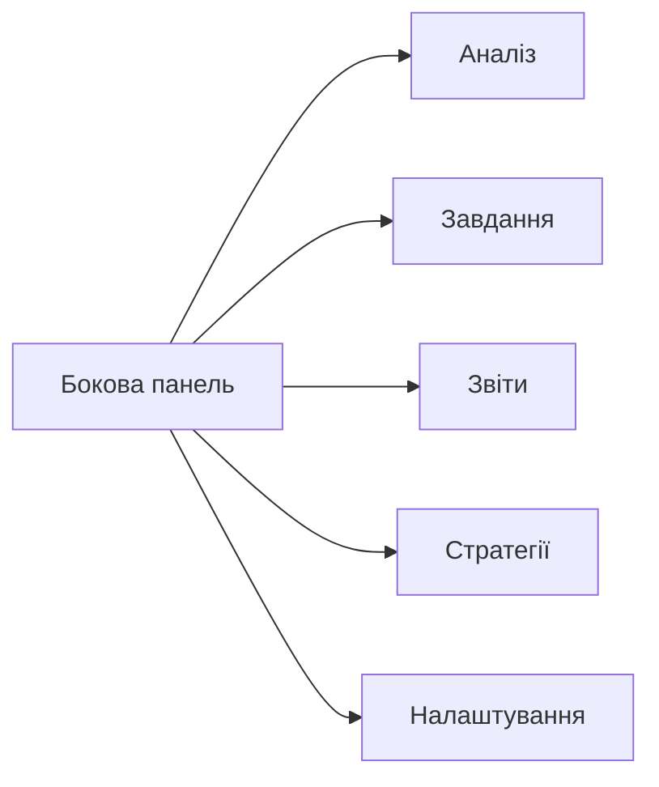

# teaa-analyzer — Технічне завдання (v3)

## Призначення

Мікросервіс для аналізу вихідного коду на відповідність вимогам EAA. Приймає код (архів або текст) та питання від користувача, виконує аналіз з використанням RAG-бази знань та LLM за конфігурованою стратегією, формує структурований звіт по розділах EAA.

---

## 1. Технологічний стек

| Компонент | Технологія |
|---|---|
| Мова | Java 21 |
| Фреймворк | Spring Boot 3.4, WebFlux |
| Збірка | Maven |
| БД | PostgreSQL 16 (власна) |
| Доступ до БД | R2DBC |
| LLM | Ollama (модель конфігурована) |
| Embeddings | TEI (окремий сервер) |
| RAG пошук | HTTP клієнт до RAG Service |
| Утиліти | Lombok |
| API документація | springdoc-openapi (Swagger) |
| Контейнеризація | Docker |
| Тести | JUnit 5, Mockito, MockWebServer |

---

## 2. Стратегії аналізу

Джерела RAG-бази мають різну природу:

| Джерело | Роль |
|---|---|
| WCAG 2.2 | Формальні вимоги — "що перевіряти" |
| EN 301 549 | Технічні деталі — "як перевіряти" |
| axe-core | Приклади правил — "що саме шукати" |
| Tizen API | Платформна специфіка — "як реалізовано" |

Порядок та спосіб використання джерел визначається стратегією — конфігурованим pipeline з кроків.

### Готові стратегії (пресети в БД)

#### parallel (за замовчуванням)

Всі джерела аналізуються паралельно, результати ранжуються.

```json
{
  "steps": [
    {
      "step": 1,
      "parallel": true,
      "actions": [
        {"source": "axe-core", "role": "Знайди порушення правил доступності"},
        {"source": "tizen", "role": "Перевір використання Accessibility API"},
        {"source": "en301549", "role": "Перевір відповідність технічним вимогам"},
        {"source": "wcag", "role": "Визнач порушення критеріїв WCAG"}
      ]
    },
    {
      "step": 2,
      "parallel": false,
      "actions": [
        {"type": "aggregate", "role": "Ранжуй за severity, дедуплікуй, згрупуй по розділах EAA, сформуй фінальний звіт"}
      ]
    }
  ]
}
```

#### concrete-to-formal

Від конкретного до загального: спочатку платформа та правила, потім стандарти.

```json
{
  "steps": [
    {
      "step": 1,
      "parallel": true,
      "actions": [
        {"source": "axe-core", "role": "Знайди порушення правил"},
        {"source": "tizen", "role": "Перевір використання API"}
      ]
    },
    {
      "step": 2,
      "parallel": false,
      "actions": [
        {"source": "en301549", "role": "Деталізуй порушення згідно EN 301 549, визнач severity", "input": "step1"}
      ]
    },
    {
      "step": 3,
      "parallel": false,
      "actions": [
        {"source": "wcag", "role": "Формалізуй у вимогах WCAG, згрупуй по розділах EAA", "input": "step2"}
      ]
    }
  ]
}
```

#### formal-to-concrete

Від загального до конкретного: спочатку вимоги, потім деталі реалізації.

```json
{
  "steps": [
    {
      "step": 1,
      "parallel": false,
      "actions": [
        {"source": "wcag", "role": "Визнач які вимоги WCAG порушує код"}
      ]
    },
    {
      "step": 2,
      "parallel": false,
      "actions": [
        {"source": "en301549", "role": "Деталізуй технічні вимоги для кожного порушення", "input": "step1"}
      ]
    },
    {
      "step": 3,
      "parallel": true,
      "actions": [
        {"source": "axe-core", "role": "Додай конкретні правила та приклади", "input": "step2"},
        {"source": "tizen", "role": "Додай рекомендації з API платформи", "input": "step2"}
      ]
    },
    {
      "step": 4,
      "parallel": false,
      "actions": [
        {"type": "aggregate", "role": "Сформуй фінальний звіт", "input": "step3"}
      ]
    }
  ]
}
```

### Власна стратегія

Користувач може створити власну стратегію через API — довільна комбінація кроків, джерел, паралельності, послідовності.

### Вибір стратегії

1. За замовчуванням — з `analysis_settings` (ключ `analysis.default-strategy`)
2. При створенні завдання — можна вказати `strategyId` або передати inline `pipeline` JSON

---

## 3. Сутності БД

### 3.1. analysis_strategies

| Поле | Тип | Опис |
|---|---|---|
| id | BIGSERIAL | PK |
| name | VARCHAR(100) | Унікальна назва: parallel, concrete-to-formal, formal-to-concrete |
| description | TEXT | Опис стратегії |
| pipeline | JSONB | Конфігурація pipeline (кроки, джерела, паралельність) |
| is_default | BOOLEAN | Чи є стратегією за замовчуванням |
| created_at | TIMESTAMP | |
| updated_at | TIMESTAMP | |

### 3.2. analysis_settings

| Ключ | За замовчуванням | Опис |
|---|---|---|
| ollama.base-url | http://localhost:11434 | URL Ollama |
| ollama.model | qwen2.5:14b | Модель LLM |
| ollama.timeout-seconds | 120 | Таймаут LLM |
| tei.base-url | http://localhost:8080 | URL TEI |
| rag.base-url | http://localhost:8082 | URL RAG Service |
| rag.wcag-source-id | 1 | sourceId для WCAG |
| rag.en301549-source-id | 2 | sourceId для EN 301 549 |
| rag.axecore-source-id | 3 | sourceId для axe-core |
| rag.tizen-source-id | 4 | sourceId для Tizen |
| rag.top-k | 10 | Кількість чанків per query |
| rag.threshold | 0.7 | Мінімальна схожість |
| analysis.default-strategy | parallel | Стратегія за замовчуванням |
| queue.poll-interval-seconds | 5 | Інтервал черги |
| queue.max-concurrent | 1 | Max одночасних аналізів |
| queue.stale-timeout-minutes | 60 | Таймаут завислих |
| code.chunk-size | 1500 | Розмір фрагмента коду |
| code.chunk-overlap | 300 | Перекриття фрагментів |

### 3.3. analysis_jobs

| Поле | Тип | Опис |
|---|---|---|
| id | BIGSERIAL | PK |
| input_type | VARCHAR(50) | TEXT, ARCHIVE |
| input_text | TEXT | Текст коду (якщо TEXT) |
| input_filename | VARCHAR(500) | Ім'я файлу (якщо ARCHIVE) |
| question | TEXT | Питання користувача |
| strategy_id | BIGINT FK | Посилання на analysis_strategies (nullable) |
| strategy_override | JSONB | Inline pipeline override (nullable) |
| status | VARCHAR(50) | PENDING, RUNNING, COMPLETED, FAILED |
| current_step | INTEGER | Поточний крок pipeline |
| total_steps | INTEGER | Загальна кількість кроків |
| progress | INTEGER | Відсоток (0-100) |
| error_message | TEXT | Помилка |
| started_at | TIMESTAMP | |
| completed_at | TIMESTAMP | |
| created_at | TIMESTAMP | |

### 3.4. analysis_reports

| Поле | Тип | Опис |
|---|---|---|
| id | BIGSERIAL | PK |
| job_id | BIGINT FK | Посилання на analysis_jobs |
| summary | TEXT | Загальний висновок |
| overall_status | VARCHAR(50) | PASS, PARTIAL, FAIL |
| report_data | JSONB | Фінальний звіт по розділах |
| step_results | JSONB | Результати кожного кроку pipeline |
| strategy_used | JSONB | Копія pipeline що використовувався |
| files_analyzed | INTEGER | Кількість файлів |
| findings_count | INTEGER | Кількість порушень |
| created_at | TIMESTAMP | |

### 3.5. analysis_files

| Поле | Тип | Опис |
|---|---|---|
| id | BIGSERIAL | PK |
| job_id | BIGINT FK | Посилання на analysis_jobs |
| file_path | VARCHAR(1000) | Шлях у архіві |
| content | TEXT | Вміст файлу |
| language | VARCHAR(50) | C, CPP, CSHARP, XAML, HTML, JS |
| created_at | TIMESTAMP | |

---

## 4. Потік аналізу



---

## 5. Структура звіту

### report_data (фінальний)

```json
{
  "summary": "Код частково відповідає вимогам EAA. Знайдено 12 порушень.",
  "overallStatus": "PARTIAL",
  "sections": [
    {
      "sectionId": "perceivable",
      "sectionTitle": "Сприйнятність (Perceivable)",
      "status": "PARTIAL",
      "findings": [
        {
          "criterion": "1.1.1",
          "title": "Non-text Content",
          "severity": "critical",
          "description": "UI-елемент Button не має accessible name",
          "file": "src/main.c",
          "line": 42,
          "codeSnippet": "btn = elm_button_add(parent);",
          "recommendation": "Додати elm_atspi_accessible_name_set(btn, \"Submit\")",
          "standard": "EN 301 549 §11.1.1.1",
          "axeRule": "button-name",
          "tvSpecific": false
        }
      ]
    },
    {
      "sectionId": "operable",
      "sectionTitle": "Керованість (Operable)",
      "status": "PASS",
      "findings": []
    },
    {
      "sectionId": "understandable",
      "sectionTitle": "Зрозумілість (Understandable)",
      "status": "FAIL",
      "findings": []
    },
    {
      "sectionId": "robust",
      "sectionTitle": "Надійність (Robust)",
      "status": "PASS",
      "findings": []
    }
  ],
  "filesAnalyzed": 8,
  "totalFindings": 12
}
```

### step_results (проміжні)

```json
{
  "steps": [
    {
      "step": 1,
      "duration": "12s",
      "actions": [
        {"source": "axe-core", "findingsCount": 8, "result": {...}},
        {"source": "tizen", "findingsCount": 5, "result": {...}}
      ]
    },
    {
      "step": 2,
      "duration": "15s",
      "actions": [
        {"type": "aggregate", "findingsCount": 12, "result": {...}}
      ]
    }
  ]
}
```

### strategy_used

Копія pipeline на момент виконання — для відтворюваності.

---

## 6. REST API

### Стратегії

| Метод | URI | Опис |
|---|---|---|
| GET | /api/v1/strategies | Перелік стратегій |
| GET | /api/v1/strategies/{id} | Деталі з pipeline |
| POST | /api/v1/strategies | Створити власну |
| PUT | /api/v1/strategies/{id} | Оновити |
| DELETE | /api/v1/strategies/{id} | Видалити |

### Аналіз

| Метод | URI | Опис |
|---|---|---|
| POST | /api/v1/analyze | Створити завдання |
| GET | /api/v1/analyze/jobs | Перелік завдань |
| GET | /api/v1/analyze/jobs/{id} | Стан (step, progress) |

Тіло POST /api/v1/analyze:

**Текст:**
```json
{
  "inputType": "TEXT",
  "text": "...код...",
  "question": "Чи відповідає цей код вимогам EAA?",
  "strategyId": 1
}
```

**Архів:** multipart — file + question + strategyId (optional)

**Inline strategy override:**
```json
{
  "inputType": "TEXT",
  "text": "...код...",
  "question": "...",
  "strategyOverride": {
    "steps": [
      {"step": 1, "parallel": true, "actions": [{"source": "wcag"}, {"source": "tizen"}]},
      {"step": 2, "actions": [{"type": "aggregate"}]}
    ]
  }
}
```

Пріоритет: strategyOverride > strategyId > analysis.default-strategy

### Звіти

| Метод | URI | Опис |
|---|---|---|
| GET | /api/v1/reports | Перелік звітів |
| GET | /api/v1/reports/{id} | Повний звіт (report_data + step_results + strategy_used) |
| GET | /api/v1/reports/{id}/summary | Тільки summary та overall_status |
| DELETE | /api/v1/reports/{id} | Видалити |

### Налаштування

| Метод | URI | Опис |
|---|---|---|
| GET | /api/v1/settings | Перелік |
| PUT | /api/v1/settings/{key} | Оновити |
| POST | /api/v1/settings/reload | Перечитати з БД |

### Стан

| Метод | URI | Опис |
|---|---|---|
| GET | /api/v1/status | Черга, Ollama/TEI/RAG доступність |

---

## 7. LLM конфігурація

### Ollama API

```
POST {ollama.base-url}/api/chat
{
  "model": "qwen2.5:14b",
  "messages": [
    {"role": "system", "content": "..."},
    {"role": "user", "content": "..."}
  ],
  "format": "json",
  "stream": false
}
```

### System prompt

Генерується динамічно з action.role у pipeline. Кожна action має свій role — він стає частиною system prompt для відповідного LLM виклику.

Загальний шаблон:
```
Ти — експерт з доступності для Tizen TV.
{action.role}
Відповідай у форматі JSON.
```

---

## 8. Обробка вхідних даних

### Текст
Код вводиться у поле. Мова визначається автоматично.

### Архів
ZIP, TAR.GZ. Розпаковується, фільтруються файли (.c, .cpp, .h, .cs, .xaml, .html, .js, .css). Зберігаються в `analysis_files`.

### Нарізка коду
Великі файли нарізаються (code.chunk-size=1500, code.chunk-overlap=300). Кожен фрагмент окремо проходить embedding.

---

## 9. UI (Analyzer UI, порт 4201)

### Сторінка "Аналіз" (`/analyze`)

- Режим вводу: текст або архів
- Поле для питання
- Вибір стратегії (dropdown з analysis_strategies, за замовчуванням — позначена is_default)
- Кнопка "Аналізувати" → створює завдання → перехід на прогрес

### Сторінка "Завдання" (`/analyze/jobs/{id}`)

- Прогрес: step N / total_steps
- Опис поточного кроку (з pipeline)
- Progress bar
- Після COMPLETED — посилання на звіт

### Сторінка "Звіт" (`/reports/{id}`)

- Summary + overall status badge
- Розділи EAA як expandable panels
- Findings з severity badges, файл:рядок, code snippet, рекомендація
- Вкладки: "Звіт" | "Кроки pipeline" — проміжні результати кожного step
- Інформація: яка стратегія використана

### Сторінка "Звіти" (`/reports`)

Таблиця: дата, status, findings, стратегія, файлів.

### Сторінка "Стратегії" (`/strategies`)

- Перелік стратегій
- Перегляд pipeline як візуальна схема (кроки, паралельність)
- Створення/редагування — JSON editor для pipeline
- Позначка default

### Навігація



---

## 10. Docker

```yaml
teaa-analyzer:
  build:
    context: ./teaa-analyzer
    dockerfile: Dockerfile
  ports:
    - "8083:8083"
  environment:
    POSTGRES_HOST: postgresql-analyzer
    POSTGRES_DB: analyzer
    POSTGRES_USER: analyzer
    POSTGRES_PASSWORD: analyzer
    OLLAMA_BASE_URL: ${OLLAMA_BASE_URL}
    TEI_BASE_URL: ${TEI_BASE_URL}
    RAG_BASE_URL: http://teaa-rag:8082
  depends_on:
    postgresql-analyzer:
      condition: service_healthy
    teaa-rag:
      condition: service_started

postgresql-analyzer:
  image: postgres:16
  environment:
    POSTGRES_DB: analyzer
    POSTGRES_USER: analyzer
    POSTGRES_PASSWORD: analyzer
  healthcheck:
    test: ["CMD-SHELL", "pg_isready -U analyzer"]

teaa-ui-analyzer:
  build:
    context: ./teaa-ui-analyzer
    dockerfile: Dockerfile
  ports:
    - "4201:4201"
  depends_on:
    - teaa-analyzer
```

---

## 11. Етапи реалізації

1. Maven module + schema.sql + entities + repositories
2. SettingsService
3. StrategyService (CRUD, вибір за замовчуванням)
4. OllamaClient (HTTP → Ollama /api/chat)
5. RagSearchClient (HTTP → RAG /api/v1/search)
6. TeiEmbedClient (HTTP → TEI /embed)
7. CodeExtractor (розпакування, визначення мови, нарізка)
8. PipelineExecutor (інтерпретує pipeline JSON, виконує кроки)
9. JobQueue + handler
10. Controllers + Swagger
11. Тести
12. Analyzer UI (Angular)
13. Dockerfile + docker-compose
