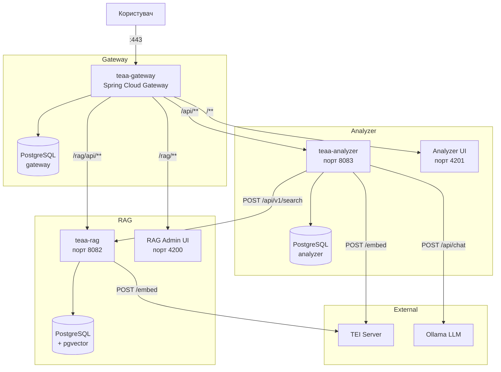
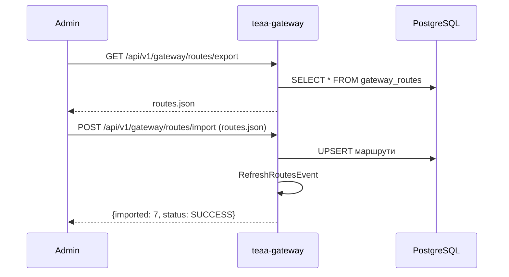
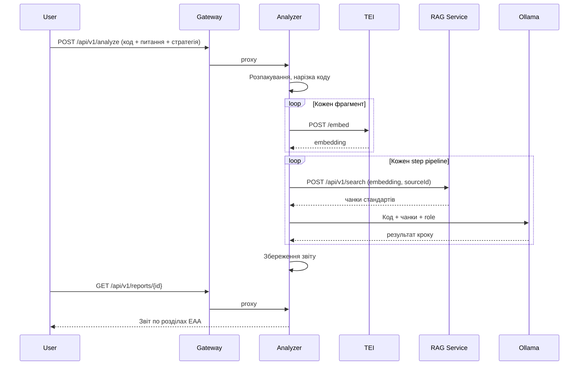

# TEAA — Повна архітектура системи

## Призначення

Система для аналізу вихідного коду Tizen TV застосунків на відповідність вимогам European Accessibility Act (EAA). Складається з RAG-бази знань стандартів, LLM-аналізатора з конфігурованими стратегіями, веб-інтерфейсів та API Gateway.

---

## Сервіси

| Сервіс | Порт | Опис |
|---|---|---|
| teaa-gateway | 443 | Spring Cloud Gateway, маршрути в БД, export/import конфігурації |
| teaa-rag | 8082 | RAG-база знань: джерела, профілі побудови, завдання, чанки, embeddings, пошук, export/import |
| teaa-analyzer | 8083 | Аналіз коду з LLM, конфігуровані стратегії pipeline |
| RAG Admin UI | 4200 | Angular, управління RAG |
| Analyzer UI | 4201 | Angular, аналіз коду, звіти |
| TEI (зовнішній) | 8080 | Text Embeddings Inference, модель конфігурована |
| Ollama (зовнішній) | 11434 | LLM (qwen2.5:14b за замовчуванням) |

---

## Інфраструктура



---

## Gateway маршрутизація

| route_id | URL pattern | Target | Пріоритет |
|---|---|---|---|
| rag-api | /rag/api/** | teaa-rag:8082 | 10 |
| rag-swagger | /rag/swagger-ui/** | teaa-rag:8082 | 15 |
| rag-ui | /rag/** | RAG UI:4200 | 20 |
| analyzer-api | /api/** | teaa-analyzer:8083 | 30 |
| analyzer-swagger | /swagger-ui/** | teaa-analyzer:8083 | 35 |
| analyzer-ui | /** | Analyzer UI:4201 | 100 |

Маршрути зберігаються в БД, змінюються через API без перезапуску. Export/import конфігурації для переносу між інстансами.



---

## RAG Service

Побудова та управління RAG-базою знань. Завантажує документацію з різних джерел, нарізає на чанки з параметрами з профілю побудови, генерує embeddings через TEI, зберігає в pgvector.

### Профілі побудови

Параметри, що впливають на результат RAG:

| Параметр | За замовчуванням | Впливає на результат |
|---|---|---|
| embedding_model | nomic-embed-text | ✓ |
| dimensions | 768 | ✓ |
| chunk_size | 800 | ✓ |
| chunk_overlap | 200 | ✓ |

Одне джерело можна побудувати кількома профілями — різний chunk_size, різна модель.

### Типи джерел

| Тип | Стратегія |
|---|---|
| HTML_SITE | WebClient + Jsoup |
| GIT_REPO | GitHub API + raw download |
| PDF | WebClient + PDFBox |
| LOCAL_FILES | Files.walk |

### Семантичний пошук

```
POST /api/v1/search
{
  "queries": [{"embedding": [...], "topK": 5}],
  "threshold": 0.8,
  "sourceId": 1
}
```

Зовнішні сервіси самостійно генерують embeddings через TEI та передають готові вектори.

### Export/Import

RAG-базу можна експортувати (JSON/SQL) та перенести на інший інстанс PostgreSQL + pgvector. Гранулярність: per collection, per source, all.

---

## Analyzer Service

Аналіз вихідного коду з конфігурованими стратегіями pipeline.

### Стратегії

3 пресети в БД, обираються при запиті або override inline:

| Стратегія | Опис |
|---|---|
| parallel (default) | 4 джерела паралельно → агрегація з ранжуванням |
| concrete-to-formal | axe-core+Tizen → EN 301 549 → WCAG |
| formal-to-concrete | WCAG → EN 301 549 → axe-core+Tizen → агрегація |

### Потік аналізу



### Структура звіту

Summary + overall status (PASS/PARTIAL/FAIL) + 4 розділи EAA (Perceivable, Operable, Understandable, Robust). Кожне порушення: criterion, severity, file:line, code snippet, recommendation, standard reference.

---

## UI

### RAG Admin UI (порт 4200, доступ через /rag/)

9 сторінок: Dashboard, Source Types, Sources, Jobs, Collections, Build Profiles, Settings, Search, Export/Import.

### Analyzer UI (порт 4201, доступ через /)

6 сторінок: Analyze (текст/архів + питання + вибір стратегії), Job Detail (прогрес по кроках), Report Detail (expandable panels по розділах EAA), Report List, Strategy List (JSON viewer, create), Settings.

Обидва UI: Angular 19+, Material, standalone components, Signals API, i18n (UK + EN), dark/light theme, корпоративний стиль.

---

## Docker Compose

8 сервісів + 3 PostgreSQL:

```yaml
services:
  teaa-gateway:        # :443  → Spring Cloud Gateway
  postgresql-gateway:  # gateway routes DB

  teaa-rag:            # :8082 → RAG Service
  postgresql:          # pgvector RAG DB
  teaa-ui:             # :4200 → RAG Admin UI

  teaa-analyzer:       # :8083 → Analyzer Service
  postgresql-analyzer: # analyzer DB
  teaa-ui-analyzer:    # :4201 → Analyzer UI
```

TEI та Ollama — зовнішні, URL через змінні оточення.

---

## REST API (зведена таблиця)

| Сервіс | Endpoint | Опис |
|---|---|---|
| Gateway | CRUD `/api/v1/gateway/routes` | Маршрути |
| Gateway | `GET/POST .../export, .../import` | Export/import конфігурації |
| RAG | CRUD `/api/v1/source-types` | Типи джерел |
| RAG | CRUD `/api/v1/sources` | Джерела |
| RAG | CRUD `/api/v1/build-profiles` | Профілі побудови |
| RAG | CRUD `/api/v1/jobs` | Завдання DOWNLOAD/EMBED |
| RAG | CRUD `/api/v1/collections` | Колекції |
| RAG | CRUD `/api/v1/settings` | Налаштування |
| RAG | `POST /api/v1/search` | Семантичний пошук |
| RAG | `GET /api/v1/export`, `POST .../import` | Export/import RAG |
| Analyzer | `POST /api/v1/analyze` | Створити аналіз |
| Analyzer | `GET /api/v1/analyze/jobs` | Завдання аналізу |
| Analyzer | `GET /api/v1/reports/{id}` | Звіт по розділах EAA |
| Analyzer | CRUD `/api/v1/strategies` | Стратегії pipeline |
| Analyzer | CRUD `/api/v1/settings` | Налаштування |
